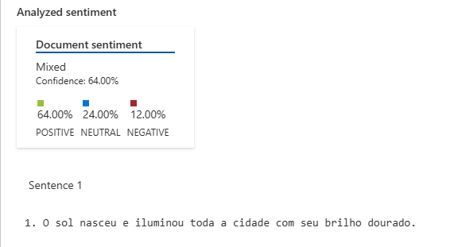
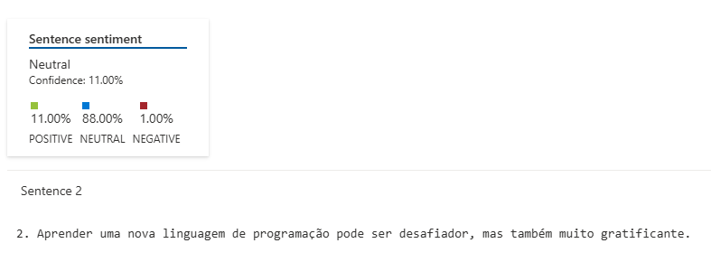
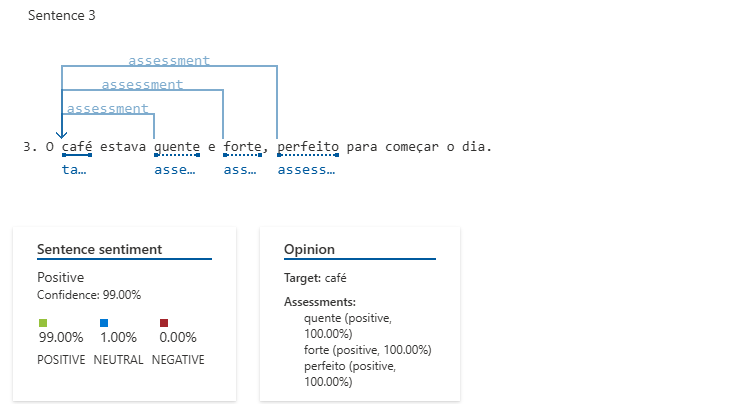
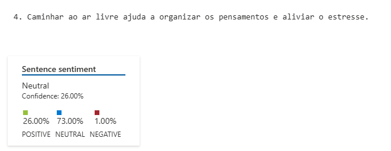
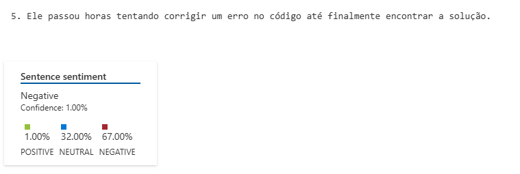

### Sentenças

1. O sol nasceu e iluminou toda a cidade com seu brilho dourado.  
2. Aprender uma nova linguagem de programação pode ser desafiador, mas também muito gratificante.  
3. O café estava quente e forte, perfeito para começar o dia.  
4. Caminhar ao ar livre ajuda a organizar os pensamentos e aliviar o estresse.  
5. Ele passou horas tentando corrigir um erro no código até finalmente encontrar a solução.  

### Analises geradas pela azure sobre as centenças

1. A primeira sentença ele achou um misto de positivo e neutro

2. A segunda ele achou extremamente neutra

3. A terceira ele identificou como extremamente positiva

4. A quarta ele identificou como neutra/positiva

5. A quinta ele identificou como neutra/negativa
