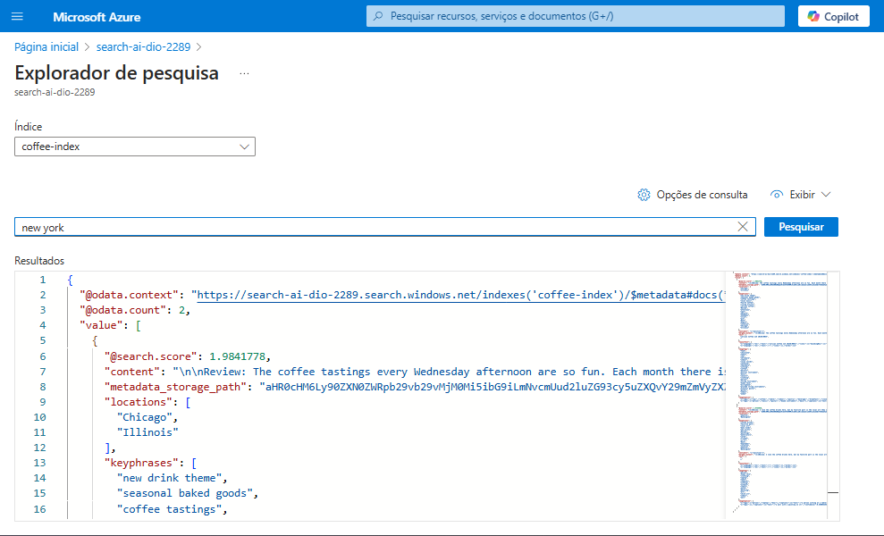

# Azure Cognitive Serarch

### Como Criar um cognitive search

[Siga os passos através do Microsoft Learn ](https://microsoftlearning.github.io/mslearn-ai-fundamentals/Instructions/Labs/11-ai-search.html)

1. Crie e configure o Azure AI Services Resource
2. Crie uma Storage Account
3. Suba os arquivos do zip do Microsoft Learn em um container
4. Use o Azure AI Search para fazer a pesquisa dos dados, mas antes configure:
    - A conexão com o data source
    - Habilitar o OCR e outros recursos de pesquisa do Azure
    - Crie um Index para realizar a pesquisa
5. Volte para o recurso Search AI criado e vá em explorador de pesquisa e faça suas pesquisas.

### Meus Insignts

Realizei o desafio conforme tudo que foi pedido e é realmente interessante como a IA pode ajudar pessoas e empres a resolver em minutos algo que seria extremamente demorado pra se fazer manualmente. Acredito que esse é o principal motivo a existência da IA, e eu como programador posso sim utilizar ela ao meu favor pra solucinar problemas.

Eu poderia criar uma deshboard retornando a quatidade de usuários negativos em uma determinada região, ou até mesmo comparar com resultados de outras localidades e exibir isso visualmente, a forma que eu posso lidar com esses dados é extensa e é meio que uma questão de criatividade pra descobrir formas de  como eu posso usar isso ao meu favor para apresentar soluções aos clientes.